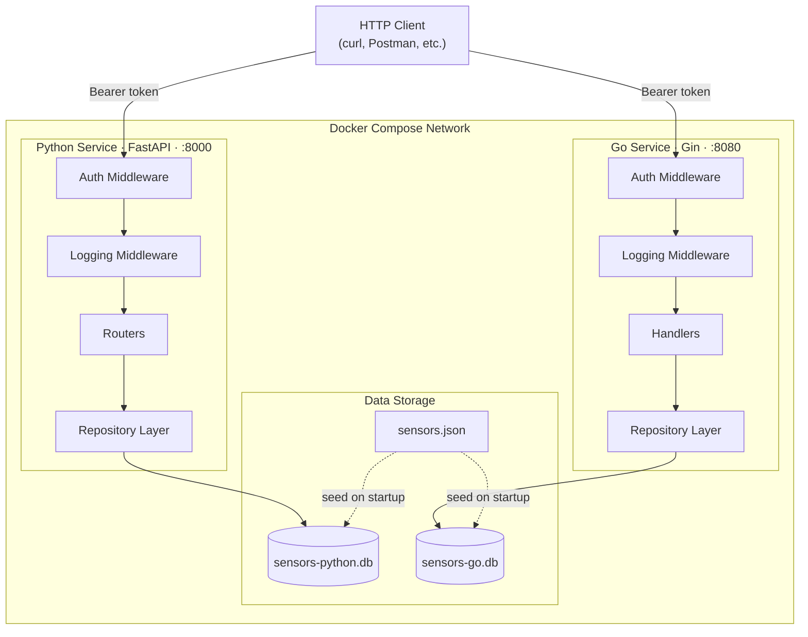
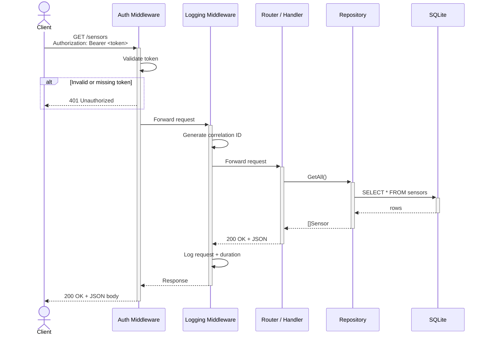

# Architecture Diagram

## Mermaid Diagram (render at mermaid.live or in GitHub)



## ASCII Diagram (for terminals/plain text)

```
                         HTTP Client
                    (curl, Postman, etc.)
                    │                   │
                    │ Bearer token      │ Bearer token
                    ▼                   ▼
╔═══════════════════════════════════════════════════════╗
║              DOCKER COMPOSE NETWORK                   ║
║                                                       ║
║  ┌─────────────────────┐   ┌─────────────────────┐   ║
║  │ Python · FastAPI     │   │ Go · Gin            │   ║
║  │ :8000                │   │ :8080               │   ║
║  │                      │   │                     │   ║
║  │  ┌────────────────┐  │   │  ┌────────────────┐ │   ║
║  │  │ Auth Middleware │  │   │  │ Auth Middleware │ │   ║
║  │  └───────┬────────┘  │   │  └───────┬────────┘ │   ║
║  │          ▼           │   │          ▼          │   ║
║  │  ┌────────────────┐  │   │  ┌────────────────┐ │   ║
║  │  │ Log Middleware  │  │   │  │ Log Middleware  │ │   ║
║  │  └───────┬────────┘  │   │  └───────┬────────┘ │   ║
║  │          ▼           │   │          ▼          │   ║
║  │  ┌────────────────┐  │   │  ┌────────────────┐ │   ║
║  │  │ Routers        │  │   │  │ Handlers       │ │   ║
║  │  └───────┬────────┘  │   │  └───────┬────────┘ │   ║
║  │          ▼           │   │          ▼          │   ║
║  │  ┌────────────────┐  │   │  ┌────────────────┐ │   ║
║  │  │ Repository     │  │   │  │ Repository     │ │   ║
║  │  └───────┬────────┘  │   │  └───────┬────────┘ │   ║
║  └──────────┼──────────┘   └──────────┼──────────┘   ║
║             ▼                         ▼              ║
║  ┌─────────────────────────────────────────────────┐ ║
║  │                 DATA STORAGE                     │ ║
║  │  ┌──────────────┐ ┌────────────┐ ┌───────────┐  │ ║
║  │  │sensors-python│ │ sensors-go │ │sensors.json│  │ ║
║  │  │    .db       │ │    .db     │ │ (seed)     │  │ ║
║  │  └──────────────┘ └────────────┘ └───────────┘  │ ║
║  └─────────────────────────────────────────────────┘ ║
╚═══════════════════════════════════════════════════════╝
```

## Key Components

| Component | Description |
|-----------|-------------|
| **Docker Compose Network** | Isolates services; all requests require Bearer token |
| **Auth Middleware** | Validates `Authorization: Bearer <token>` header on every request |
| **Logging Middleware** | Adds correlation ID (`X-Correlation-ID`) for request tracing |
| **Routers/Handlers** | Route definitions and business logic for CRUD operations |
| **Repository Layer** | Data access abstraction (injected via DI) |
| **SQLite Databases** | Separate database per service to avoid conflicts |
| **Seed Data** | `sensors.json` loaded on startup if database is empty |

## Request Flow

The sequence diagram below shows how a typical authenticated request flows through the middleware chain. Both services follow this identical pattern.



### Steps

1. Client sends HTTP request with `Authorization: Bearer <token>` header
2. Auth Middleware validates token → returns 401 if invalid
3. Logging Middleware generates/extracts correlation ID, logs request
4. Router/Handler processes request, calls Repository
5. Repository executes SQL against SQLite database
6. Response returned with correlation ID in logs
